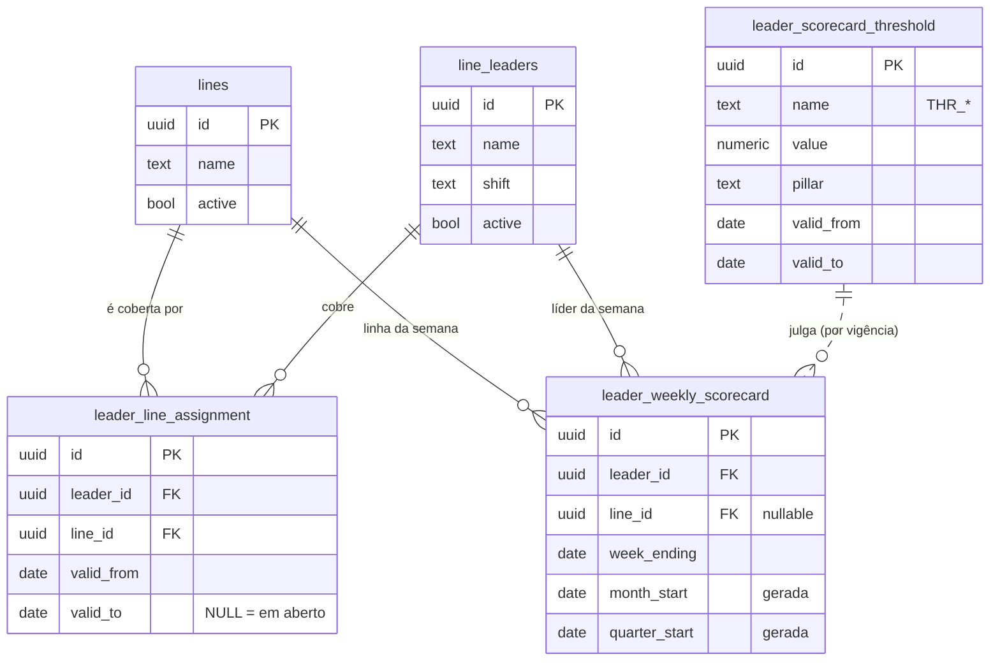

# Scorecard de Líderes de Linha — v2 (dois gates)

Contrato de dados do scorecard semanal, na base. Implementação:

- Migração: [20260815140000_health_and_safety_is_the_second_gate.sql](../supabase/migrations/20260815140000_health_and_safety_is_the_second_gate.sql)
- Testes: [leader_weekly_scorecard_test.sql](../supabase/tests/leader_weekly_scorecard_test.sql)
- v1 (um gate, sem linha, sem H&S): [20260814090000_the_week_is_red_when_the_check_is_missed.sql](../supabase/migrations/20260814090000_the_week_is_red_when_the_check_is_missed.sql)

Base de dados: **PostgreSQL** (Supabase). Sistema: **ANMAI SYS**.

---

## 1. Entidades

**Reutilização deliberada.** `lines` e `line_leaders` já existem e já são mantidas neste
sistema. A spec pedia `production_line` e `line_leader` novas; criá-las teria produzido
um terceiro catálogo de linhas e um quarto de líderes. O que falta a ambas — e é o que
esta migração acrescenta — é `leader_line_assignment`: o par **com datas**.
`line_leaders.line` é um texto único e sem histórico, que não consegue exprimir uma
troca de linha a meio do trimestre.

## 2. Modelo de dados — `leader_weekly_scorecard`

Grão: **líder × linha × semana**, único (`NULLS NOT DISTINCT`, para que as semanas sem
linha também colidam entre si).

| Campo | Tipo | Nulo? | Regra de domínio |
|---|---|---|---|
| `leader_id` | uuid FK | não | → `line_leaders` |
| `line_id` | uuid FK | **sim** | → `lines`. Nulo é uma lacuna nomeada pelo `rag_driver`, não uma recusa da linha |
| `week_ending` | date | não | último dia da semana |
| `month_start` / `quarter_start` | date | não | geradas (`date_trunc`); os rótulos `jul-2026` / `Q3-2026` são construídos na leitura |
| `planned_volume` | integer | sim | `> 0` — zero não é um plano, é uma divisão impossível |
| `actual_volume` | integer | sim | `>= 0` |
| `unplanned_downtime_minutes` | integer | sim | `>= 0` |
| `downtime_reason` | enum | sim | Quebra / Falta de Materia Prima / Troca de Mix / Falta de Pessoal / Outro / NA |
| `ccp_check_status`, `starter_check_status`, `volume_weight_check_status` | enum | sim | Pass / Fail / Not Done. Nulo = não registado |
| `lost_time_injuries`, `reportable_accidents`, `first_aid_cases`, `near_misses_reported`, `safety_observations_done`, `toolbox_talks_done`, `overdue_hs_actions` | integer | sim | `>= 0` |
| `ppe_compliance_pct`, `hs_training_compliance_pct` | numeric(5,4) | sim | `BETWEEN 0 AND 1` |
| `leader_attendance_pct`, `team_attendance_pct` | numeric(5,4) | sim | `BETWEEN 0 AND 1` — **monitorado, não pontua** |
| `leader_lateness_incidents`, `team_lateness_incidents` | integer | sim | `>= 0` — **monitorado, não pontua** |
| `root_cause`, `corrective_action`, `capa_owner` | text | sim | obrigatórios para aprovar um `Fail` |
| `capa_due_date` | date | sim | idem |
| `capa_status` | enum | sim | Aberta / Em Andamento / Concluida / Verificada |
| `effectiveness_verified_by` / `_on` | uuid / date | sim | ambos ou nenhum (CHECK) |
| `submitted_by` / `submitted_at` | uuid / timestamptz | sim | trilha |
| `approved_by` / `approved_at` | uuid / timestamptz | sim | ambos ou nenhum (CHECK); o trigger da CAPA guarda a porta |

Índices: um por agrupamento de rollup — `(leader_id, month_start)`,
`(leader_id, quarter_start)`, `(line_id, month_start)`, `(line_id, quarter_start)`,
`(leader_id, line_id, week_ending DESC)`, mais o único do grão.

## 3–4. Limiares com vigência

`leader_scorecard_threshold(name, value, pillar, valid_from, valid_to)`, com uma
restrição de exclusão GiST que proíbe dois períodos sobrepostos para o mesmo nome.
**Nenhum limiar aparece dentro de query, view ou função** — todos são resolvidos à data
da semana julgada (`week_ending`), ou ao fim do período nos rollups.

Alterar um limiar é *fechar* a linha atual (`valid_to`) e inserir a seguinte. Nunca um
`UPDATE` do valor: isso reescreveria o julgamento de todas as semanas já registadas.

Seed: os 12 valores da spec, mais `THR_TrendEpsilon` (ver secção 9).

## 5. Os quatro pilares

Tudo em **funções `IMMUTABLE` + uma view** (`v_leader_weekly_scorecard`). Porquê view,
e não coluna gerada nem trigger:

- **coluna gerada** tem de ser `IMMUTABLE` e não pode ler outra tabela → cada banda
  teria de ser um literal dentro da definição da coluna, e re-bandar significaria
  reescrever a tabela;
- **trigger** congela o RAG no momento em que a semana foi escrita → um limiar editado
  deixa o histórico a discordar da regra que o produziu até alguém fazer backfill;
- **view** calcula na leitura: uma definição, sem backfill, e como os limiares são
  resolvidos à data da semana, um trimestre fechado mantém as bandas sob as quais foi
  julgado.

As funções recebem os limiares como argumentos (não os leem), por isso a **mesma**
função julga a semana e a média do trimestre.

| Regra | Onde |
|---|---|
| C — volume, bandas | `scorecard_volume_rag()` — acima do teto é **Amber** (superprodução é desperdício) |
| C — volume ajustado | `scorecard_volume_pct_adjusted()` — informativo; o RAG oficial lê o **bruto** |
| D — qualidade | `scorecard_quality_rag()` / `scorecard_quality_fail_type()` |
| E — H&S | `scorecard_hs_evaluate()` → devolve `(rag, drivers[])` numa só chamada |
| G — overall | `scorecard_overall_rag()` — os dois gates, primeiras linhas do CASE |
| H — driver | expressão única na view, na ordem Qualidade → H&S → Volume → Dados ausentes |

**A regra invertida.** `near_misses_reported` abaixo do mínimo é **Amber**. Zero
quase-acidentes reportados é sub-reporte, não uma linha segura. Nunca é somado com
`first_aid_cases`: um é sinal antecedente, o outro é consequência.

**Convenções de nulo em H&S** (não são a mesma coisa):

- **os nove campos vazios** → `hs_rag` nulo. Nunca Green, nunca Amber.
- **alguns campos vazios** numa semana que teve recolha → a lacuna é Amber. Exceto as
  duas condições de Red, que exigem um número real: uma formação em branco não pode
  tornar a semana Red sozinha.

## 6. Rollups, resumo, tendência e ranking

| Objeto | O que é |
|---|---|
| `v_scorecard_period_spine` | líder × linha × período, a partir da **atribuição versionada** |
| `v_scorecard_rollup_leader` | **A** — líder × período |
| `v_scorecard_rollup_line` | **B** — linha × período |
| `v_scorecard_rollup_leader_line` | **C** — líder × linha × período |
| `v_scorecard_trend_leader` / `_line` | médias móveis de 4 semanas + direção pela inclinação de 8 |
| `v_scorecard_ranking_leader` / `_line` | `pct_weeks_red` desc, desempate por `weeks_with_fail` e `total_lti`; exclui grupos com menos de `THR_MinWeeks` |
| `leader_scorecard_summary(from, to, leader?, line?)` | resumo executivo, sempre uma linha |

Mensal e trimestral vivem na **mesma** view, distinguidos por `period_type` — não há
duas cópias da mesma aritmética.

**A espinha é o que torna o guard 1 possível.** Um `GROUP BY` sobre as semanas só
consegue produzir grupos que *têm* semanas; o caso que a folha de cálculo errou — um
líder sem nada registado no mês a aparecer Green porque um `COUNTIFS` de falhas
devolveu zero — nem sequer é exprimível como linha. Por isso os rollups partem da
atribuição e fazem `LEFT JOIN` às semanas.

- **Guard 1** — grupo sem nenhuma semana → `quality_rag = 'Sem dados'`.
- **Guard 2** — grupo com semanas mas sem nenhum dado de H&S → `hs_rag = 'Sem dados'`,
  **não Amber**. Sem esta linha, `near_misses_per_week = 0` dispara a regra de
  sub-reporte e um grupo que ninguém preencheu aparece meramente âmbar, escondendo que
  ninguém preencheu.

A e B **não** são somas de C: um líder em duas linhas tem de fazer a média das suas
semanas uma vez, não a média de duas médias — isso pesaria uma linha com uma semana
igual a uma linha com dez.

## 7. CAPA obrigatória e trilha de auditoria

`trg_scorecard_require_capa` (BEFORE INSERT OR UPDATE). Uma semana com
`quality_fail_type = 'Fail'` não pode ser **aprovada** sem `root_cause`,
`corrective_action`, `capa_owner` e `capa_due_date`. Está no trigger e não na UI porque
uma validação de UI é uma sugestão: o próximo ecrã, o próximo script de importação e o
SQL editor passam ao lado dela.

Dispara na **aprovação**, não na escrita: alguém tem de poder registar a falha no dia em
que acontece e preencher a investigação depois; o que não pode é chamar-lhe aprovada
antes disso. Uma aprovação sem `approved_by` também é recusada — uma aprovação anónima
não é trilha.

## 8. Casos de teste

Todos em [leader_weekly_scorecard_test.sql](../supabase/tests/leader_weekly_scorecard_test.sql).
Corre dentro de uma transação com `ROLLBACK`; imprime `ALL TESTS PASSED` ou aborta a
nomear o caso.

| Cenário | Entrada | Saída esperada | Regra validada |
|---|---|---|---|
| Grupo sem nenhuma semana | atribuição ativa, 0 semanas | `weeks_recorded=0`, `quality_rag='Sem dados'`, `hs_rag='Sem dados'`, `overall=NULL`, `near_misses_per_week=NULL` | Guard 1 — ausência ≠ Green |
| Semanas sem dados de H&S | 1 semana, os 9 campos nulos | `hs_rag='Sem dados'`, `overall='Green'` | Guard 2 — ausência ≠ Amber |
| Zero near-miss | near=0, resto conforme | `hs_rag='Amber'`, driver com "sub-reporte" | Lógica invertida |
| Superprodução | 1082/1000 | `volume_rag='Amber'`, driver "108,2% (superproducao)" | Teto do volume |
| Fail vs Not Done | CCP=Fail / Vol&Peso=Not Done | ambos `quality_rag='Red'`; `fail_type` distinto; `capa_required` só no Fail | Distinção BRC |
| LTI com tudo verde | LTI=1, volume 100%, qualidade Green | `overall='Red'` | Gate de H&S |
| Troca de linha a meio do trimestre | 2 atribuições, 1 semana de cada lado | A=2 semanas; B=1 e 1; C=2 linhas com 1 semana cada; agosto só a linha nova | Atribuição versionada |
| Downtime não planeado | 900/1000, 240 min | `volume_pct=0.9000`, ajustado `1.0000`, `volume_rag='Red'` | O RAG oficial lê o bruto |
| Aprovar Fail sem CAPA | approved_by/at, CAPA vazia | exceção `check_violation` | Bloqueio da CAPA |
| Aprovar sem assinatura | `approved_at` sem `approved_by` | exceção | Trilha de auditoria |
| Atribuição sobreposta | mesmo par, período a sobrepor | `exclusion_violation` | Versionamento |
| Ranking com 1–2 semanas | todos abaixo de `THR_MinWeeks` | 0 linhas | Amostra insuficiente |
| Período vazio no resumo | intervalo sem semanas | 1 linha, `weeks=0`, `pct_weeks_red=NULL` | Taxa sobre nada ≠ zero |

## 9. Riscos, ambiguidades e decisões tomadas

**Decisões que se afastam da spec, deliberadamente:**

1. **A ordem do `overall_rag`.** A spec lista "nulo se `volume_rag` ou `quality_rag`
   forem nulos" como **primeira** regra — o que deixaria uma semana com acidente com
   afastamento a ler `NULL` só porque ninguém escreveu o plano de produção. Um gate que
   um número em falta consegue abrir não é um gate. Os Red/Amber são decididos primeiro
   e o `NULL` é o que sobra. Para repor a leitura literal, mover as duas linhas de NULL
   para o topo do `CASE` em `scorecard_overall_rag()` — nada mais muda.
2. **`production_line` / `line_leader` não foram criadas.** Reutiliza `lines` e
   `line_leaders`, que já existem. Só a atribuição versionada é nova.
3. **`THR_TrendEpsilon`** é o único parâmetro fora da lista da spec. A alternativa era
   um literal dentro da view de tendência a decidir quando uma inclinação conta como
   movimento — e um literal numa query é a coisa que este módulo recusa. Pôr a 0 faz a
   direção ler-se apenas pelo sinal da inclinação.
4. **Semana de qualidade parcialmente preenchida** (um Pass e dois nulos) é **Red**,
   com `fail_type = 'Not Done'`. A spec só define o caso dos três vazios. Num contexto
   BRC-HACCP, um check não registado não é um check que passou.
5. **Migração `'N'` → `'Not Done'`.** A v1 não distingue as duas coisas e chamar
   *reprovado* a um check que ninguém fez inventaria um desvio de produto. Quem souber
   melhor corrige à mão — os mesmos 4 registos que a folha de cálculo assinala.
6. **Acentuação.** O texto de `rag_driver` segue os exemplos da spec, sem acentos.

**Riscos por resolver:**

- **O SQL não foi executado.** Não há Postgres local nesta máquina (`psql`/docker
  ausentes) e o MCP do Lovable não está autorizado nesta sessão. A migração e os testes
  estão escritos, revistos e não *corridos*. O ficheiro de testes é a forma de o fazer:
  corre inteiro no SQL Editor e faz `ROLLBACK`.
- ~~**A v1 pode nunca ter chegado à produção.**~~ **Confirmado: não chegou.** Um GET ao
  PostgREST com a chave pública devolve `PGRST205` (tabela inexistente) para
  `leader_weekly_scorecard` e `leader_scorecard_thresholds`, e `HTTP 200` para `lines` e
  `line_leaders`. A migração v2 passou por isso a **criar a tabela se ela não existir**,
  na forma da v1, para que tudo o que vem a seguir — ALTERs, renames, backfill — seja um
  único caminho de código, quer a base já tenha visto a v1 quer não. Não é preciso
  aplicar a v1 primeiro.
- **`NULLS NOT DISTINCT`** exige PostgreSQL 15+.
- **`btree_gist`** tem de poder ser criada; sem ela as duas restrições de não-sobreposição
  não são aplicáveis.
- **Nomes órfãos.** Se alguma semana da v1 tiver um `line_leader` que não case com
  `line_leaders.name` (fold de maiúsculas incluído), a migração **aborta com uma
  mensagem a nomear os órfãos**, em vez de inventar líderes ou perder semanas.
- **`line_id` fica vazio nas semanas herdadas** — tal como a coluna B da folha de
  cálculo. O rollup B (por linha) só as inclui depois de alguém a preencher; até lá elas
  contam no rollup A e aparecem em `rows_missing_line`.
- **Sem UI.** Este módulo não tem ecrã. Enquanto não tiver, `submitted_by`/`approved_by`
  dependem de quem escreve na tabela.
